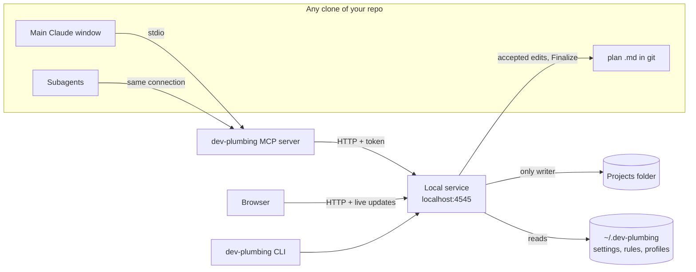
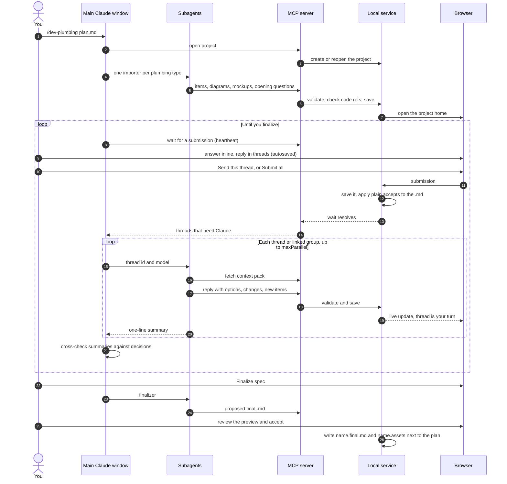

# dev-plumbing: design spec

Status: design draft for review · 2026-09-30 · no code yet

---

## TL;DR

- You write a plan with Superpowers (or any Markdown file), then run **`/dev-plumbing path/to/plan.md`** in Claude Code.
- dev-plumbing turns the plan into a **plumbing project**: a local web app at **`localhost:4545`**. Its views are **plumbing types**:
  - **drawn as diagrams:** Architecture, Database, UI changes, Flows
  - **shown as lists:** Questions, Concerns, Ideas, Phases, Testing & rollout, Security.
- **Every item has its own conversation thread.** You always see what's waiting on you, what's with Claude, and what's resolved. Claude's choices come as radio buttons, each with an optional note, plus a Custom answer.
- **Send one thread or Submit all.** Your main Claude window gets the list and starts **one subagent per thread**. The window only ever sees one-line summaries, so its context never fills up.
- Accepted answers are **written into the original `.md`** as you go. **Finalize spec** then writes a separate **`<name>.final.md`** next to it, in a standard structure an AI can build from exactly as designed, with Mermaid diagrams and the mockups alongside.
- **Whiteboard Defense** turns the plumbing project into something you can explain on a whiteboard before you ship, in three modes: **Present** (an animated whiteboard), **Study** (a 13-part guide) and **Practice** (flashcards and a checklist).
- **The Ink wash look**, Apple-style: a white canvas (ink night in dark mode), ink text and a slate accent. Seal red, moss, amber and ochre appear only as small signals. One column on mobile.
- **Everything is tunable in plain files** in `~/.dev-plumbing/`: settings, agent config, repo profiles, and one **rules file per plumbing type**. Adding a plumbing type means adding one Markdown file. A README and the in-app help explain every setting.

## Decisions so far

| Topic | Decision |
|---|---|
| Name | **dev-plumbing**. One plan being plumbed is a **plumbing project**. Each view is a **plumbing type**. |
| Input | Any Markdown plan, usually a Superpowers spec. |
| Who answers threads | Your **main Claude window**. It receives each submission and starts **subagents**: one per thread, or one per group of closely linked threads. |
| Sending | **Send this thread**, or **Submit all** (every thread with new input from you). |
| The `.md` | Stays in git where it was written. Accepted changes are written into it as you go. **Finalize spec** never touches it: it writes `<name>.final.md` (the standard AI-ready structure, with Mermaid diagrams) and `<name>.assets/` (mockups) next to it. |
| Look | **Ink wash**, Apple-style. White canvas in light mode, ink night in dark mode; follows the system, with a toggle. Colour only as dots, text and thin lines. One column on mobile. See §16. |
| Defaults | Projects folder `~/dev-plumbing-projects`. Sonnet for imports and threads, Opus for Finalize and Whiteboard Defense. |
| Auto-apply | Small things (wording, typos, diagram layout) apply straight away with Undo. Anything that changes meaning waits for you. |
| Answering | Radio buttons, each with an optional note, plus a Custom answer. Open items can be answered inline in lists. |
| Service | Runs on its own, whether or not Claude is running, on the **fixed port 4545**. **Starts at login** by default. You can work in the app any time; replies from Claude need a Claude window. |
| Config | `~/.dev-plumbing/`: `settings.json`, `agents.json`, `repos/*.json` (repo profiles), `plumbing/*.md` (rules per plumbing type), `outputs/*.md` (Finalize and Whiteboard Defense rules), and a README. All of it can be edited in the app. |
| Storage | A projects folder, set in the app (default `~/dev-plumbing-projects`). Any repo can override it, e.g. with a folder shared by several clones and linked into each one. |
| Repo-specific knowledge | Kept in **repo profiles** on your Mac, detected on first use and editable. The code and the public repo contain nothing specific to one repo. |
| Diagrams | dev-plumbing's own renderer: Claude describes each diagram as data, and the app checks it against the code, lays it out and draws it. Mermaid is only used for export into the `.md`. |
| Screens | App home (search, 10 most recent, Load more). Project home (inbox, with the plumbing types on the left). Thread view (item on top, conversation below). Database (relationship strip, diff cards, migration panel). UI (large mockup with pins). Flows (storyboard or sequence diagram, chosen per flow). Lists (rows with inline answers). |
| Whiteboard Defense | Built from the plan now, and later from the real code diff. Present, Study and Practice modes. Your `whiteboard-defense.md` is the default rules file. |
| Stack | TypeScript, Node 22, pnpm workspaces, Hono, Zod, React 19 + Vite, Tailwind v4 + shadcn/ui, ELK.js, Motion, Rough.js, the MCP SDK, Vitest, Playwright. |
| Code repo | `github.com/jordanframptondev/dev-plumbing` (public, generic). |

---

## 1. Problem

Planning a large feature produces one big Markdown file full of design choices, questions and concerns.

- **Reviewing it in a single chat breaks down.** The AI spends its context on the first few big questions and the rest get lost.
- **Nothing shows what's settled.** You can't see which answers are in, which are pending, or which the AI has already acted on.
- **The important parts stay as prose,** or rough ASCII: architecture, schema changes and UI changes are hard to judge that way.
- **Engineers ship AI-written code they can't fully explain.** The owner of the change should be able to defend it on a whiteboard.

## 2. Goals and non-goals

**Goals**

1. Turn any plan `.md` into a structured, visual plumbing project.
2. Give every piece of information its own thread and status: your turn, draft, with Claude, resolved or parked.
3. Make answering fast: radio buttons, a note and Custom, inline where possible.
4. Keep the main Claude window's context small by doing per-thread work in subagents.
5. Write accepted outcomes into the `.md`. Finalize it into a structure an AI can implement faithfully.
6. Help the engineer understand and defend the change (Whiteboard Defense).
7. Make everything tunable in clear, documented files: rules, agents and settings.
8. Never lose work: autosave, submissions saved before Claude sees them, resume from any clone.

**Non-goals**

- Writing the first version of the plan. Superpowers `brainstorming` or you do that.
- Implementation tasks. `writing-plans`, GSD or Deep Trilogy take the finalized `.md` from here.
- Hosting, multiple users, sharing, login.
- A desktop app (maybe later).

## 3. Where it fits

```
brainstorming ──► plan .md ──► /dev-plumbing plan.md ──► Finalize spec ──► writing-plans ──► build
                  in git       threads, views, answers   plan.final.md          (or GSD / Deep Trilogy)
                                         └──► Whiteboard Defense (before shipping; later on the code diff)
```

## 4. Words we use

| Word | Meaning |
|---|---|
| **Repo** | A code repository, identified by its git remote. Several clones of one repo count as the same repo. |
| **Repo profile** | Your settings for one repo, e.g. where its plumbing projects live, its schema file, conventions, apps and sensitive-data tags. |
| **Plumbing project** | One plan being plumbed, e.g. "Restock reminders". |
| **Plumbing type** | One kind of view, e.g. Database or Concerns. Each is defined by a rules file. |
| **Item** | One thing inside a plumbing type: a table change, a question, a concern… |
| **Thread** | The conversation attached to an item. |
| **Submission** | What happens when you press **Send this thread** or **Submit all**. |
| **Decision** | A one-line record of how a thread was settled. |
| **Main window** | The Claude Code session running `/dev-plumbing`. It listens for submissions and starts subagents. |

---

## 5. How it runs

- **A small Node service on your Mac serves the app at `http://localhost:4545`.** Nothing is deployed.
  - It **starts at login** by default (a macOS login item, managed by the app).
  - `/dev-plumbing` and `dev-plumbing start` also start it if it isn't running.
- **The service runs by itself.** Close every Claude window and you can still open the app, browse, answer, draft and accept proposals. Only Claude's replies, Finalize and Whiteboard Defense generation need a main window.
- **All state is in files.** Stopping the service loses nothing.
- **Installed once as a Claude Code plugin,** for your user, and then it works in every repo. The plugin brings:
  - the `/dev-plumbing` skill
  - the subagent definitions
  - a small MCP server (the bridge between Claude and the service)
  - the built service and web app.
- **The `dev-plumbing` CLI** has these commands: `setup`, `start`, `stop`, `status`, `open`, `docs`.



| Piece | What it does |
|---|---|
| `/dev-plumbing` skill | Imports a plan, resumes a plumbing project, and keeps the main window listening. Run with no argument, it lists this repo's plumbing projects. |
| Subagents | Each one follows its rules file (§6). **repo-setup** detects a repo's profile the first time. **importer** runs once per plumbing type. **thread** handles one thread or linked group. **finalizer** writes the final `.md`. **whiteboard** writes the Whiteboard Defense. |
| MCP server | A thin bridge that turns tool calls into requests to the service. It holds no state. |
| Local service | HTTP API, live updates (SSE), the web app, validation, checking code references, patching the `.md`, the login item. **The only writer of the projects folder.** |
| Web app | React. App home, project home, plumbing-type screens, thread view, Finalize, Whiteboard Defense, Settings, Plumbing rules. |

---

## 6. Configuration: `~/.dev-plumbing/`

Everything you might want to fine-tune is a plain file here. The app's **Settings** and **Plumbing rules** pages edit these files; you can also open them in your editor. **Setup** copies the defaults from the code repo's `defaults/` folder. **Reset to default** is available for each file.

```
~/.dev-plumbing/
  README.md                 # generated: explains every file and every setting
  settings.json             # app settings
  agents.json               # subagent settings
  repos/
    acme.json               # one repo profile per repo
  plumbing/                 # one rules file per plumbing type (the sidebar is built from these)
    architecture.md  database.md  ui.md  flows.md  questions.md
    concerns.md  ideas.md  phases.md  testing.md  security.md
  outputs/
    finalize.md             # rules for Finalize spec
    whiteboard-defense.md   # rules for Whiteboard Defense (your framework is the default)
  run/service.json          # port, pid, token for the running service (managed by the app)
```

### 6.1 `settings.json`

| Key | Default | What it does |
|---|---|---|
| `port` | `4545` | The port the app and service use, on `localhost` only |
| `projectsFolder` | `~/dev-plumbing-projects` | Where plumbing projects are stored. Each repo gets a subfolder, unless its repo profile sets its own folder. |
| `startAtLogin` | `true` | Start the service when you log in to your Mac |
| `openBrowserOnImport` | `true` | Open the plumbing project in your browser after `/dev-plumbing` imports a plan |
| `autoApplySmallEdits` | `true` | Apply Claude's wording, typo and layout fixes immediately, each with Undo |
| `homePageSize` | `10` | How many recent plumbing projects the app home shows before **Load more** |
| `theme` | `"system"` | `light`, `dark` or `system` |

### 6.2 `agents.json`

| Key | Default | What it does |
|---|---|---|
| `maxParallel` | `4` | The most subagents running at once |
| `groupLinkedThreads` | `true` | Send threads that share linked items to one subagent, so they can't contradict each other |
| `models.repoSetup` | `"sonnet"` | Model for detecting a repo profile |
| `models.importer` | `"sonnet"` | Model for importing each plumbing type |
| `models.thread` | `"sonnet"` | Model for thread replies |
| `models.finalizer` | `"opus"` | Model for Finalize spec |
| `models.whiteboard` | `"opus"` | Model for Whiteboard Defense |
| `waitHeartbeatSeconds` | `60` | How often the listening main window reports that it's still waiting |

### 6.3 Repo profiles: `repos/<repo>.json`

A profile is created the first time you run `/dev-plumbing` in a repo. The **repo-setup** subagent detects the values, and you confirm them in **Settings → Repos**. The example uses a made-up app.

```jsonc
{
  "name": "acme",
  "match": ["github.com/acme/acme"],            // git remotes that identify this repo
  "projectsFolder": "~/Source/acme-shared/dev-plumbing", // optional; overrides settings.projectsFolder
  "linkIntoClones": { "enabled": true, "linkName": "dev-plumbing" }, // symlink the folder into each clone
  "planFolders": ["docs/specs"],                // where plans usually live (used by the file picker)
  "schema": { "type": "prisma", "path": "packages/db/prisma/schema.prisma" },
  "conventions": [                              // plain-English rules the subagents must follow
    "Foreign keys are named <model>Id",
    "Ids use uuid()"
  ],
  "apps": [
    { "name": "web",   "path": "apps/web",   "kitFiles": ["packages/ui/theme.css", "apps/web/app/globals.css"] },
    { "name": "admin", "path": "apps/admin", "kitFiles": ["packages/ui/theme.css", "apps/admin/app/globals.css"] }
  ],
  "sensitiveData": ["PII", "payments"]          // raises the Whiteboard Defense level and security checks
}
```

When `linkIntoClones` is on, the service creates `<clone>/dev-plumbing`, pointing at the projects folder, in every clone it sees. It also adds `/dev-plumbing` to that clone's `.git/info/exclude`, so git ignores the link.

### 6.4 Plumbing types: `plumbing/<type>.md`

Each plumbing type is **one Markdown file**:
- **The header** tells the app how to show it.
- **The body** is the rules and criteria the subagents follow. The importer gets the whole file. Thread subagents get the **Rules** section.

```markdown
---
id: database
title: Database
order: 2
screen: database            # which screen draws it: diagram | database | mockups | flows | list
emptyMessage: This plan doesn't change the database.
fields: []                  # extra fields for list screens, e.g. [severity, likelihood]
answerPresets: []           # standard choices, e.g. ["Accept Claude's fix", "Accept the risk"]
timeline: false             # list screens only: show a timeline strip (used by Phases)
enabled: true
---

## What to look for
- New, changed or removed tables, fields, indexes, enums and relations.
- Data that must be backfilled or migrated.

## Rules
- Compare every change with the schema file in the repo profile.
- New names follow the repo profile's conventions.
- Every backfill, destructive change and data-consent risk goes in the migration panel.
- One item per table touched.

## Done when
- Every touched table has a diff card with an exact schema diff.
- The migration panel says how to roll back.

## Always ask
- Can this change be undone without losing data?
```

**Default plumbing types**

| id | Title | Screen | Extras |
|---|---|---|---|
| `architecture` | Architecture | diagram | several diagrams per plumbing project |
| `database` | Database | database | migration panel, Prisma tab |
| `ui` | UI changes | mockups | kits, pins, Before/After |
| `flows` | Flows | flows | user flows as storyboards, system flows as sequences |
| `questions` | Questions | list | `blocking`, `default` |
| `concerns` | Concerns | list | `severity`, `likelihood`. Presets: Accept Claude's fix / Accept the risk |
| `ideas` | Ideas | list | `effort`. Presets: Add to scope / Park for later / Drop |
| `phases` | Phases & milestones | list | `timeline: true`, "done when" per phase, no tasks |
| `testing` | Testing & rollout | list | tags such as FLAG and ROLLBACK |
| `security` | Security & permissions | list | tags such as PII and AUTH |

**Adding a plumbing type:** on the **Plumbing rules** page click **+ Plumbing type**, or copy a file in `plumbing/`. Give it an `id`, a title, a `screen` (usually `list`) and its rules. It appears in every project's sidebar, and the next import uses it. The five screens are code; everything else is content.

### 6.5 Output rules: `outputs/*.md`

- **`finalize.md`:** the structure and rules for the finalized `.md` (§11).
- **`whiteboard-defense.md`:** the Whiteboard Defense framework (§12). The default is your framework document: the 23 areas, the three review levels, the 13-part output, the checklist and the rules for how the AI should behave.

### 6.6 README and in-app help

Every setting is defined once in code, as a Zod schema with a description. `dev-plumbing docs` (also run by setup) writes `~/.dev-plumbing/README.md` from those schemas and the rules-file format. The Settings page shows the same descriptions as help text beside each field, so the README and the app always agree.

### 6.7 Setup

`dev-plumbing setup`, or the app's first-run screen, does five things:
1. Creates `~/.dev-plumbing/` from the defaults and writes the README.
2. Asks where to store plumbing projects (`projectsFolder`).
3. Offers **Start dev-plumbing when I log in** (on by default) and installs the login item.
4. Installs the Claude Code plugin for your user (`claude plugin marketplace add` and `claude plugin install`).
5. Starts the service and opens the app.

---

## 7. Where plumbing projects are stored

```
<projects folder for the repo>/            # settings.projectsFolder/<repo>, or the repo profile's projectsFolder
  restock-reminders/                       # one folder per plumbing project
    project.json                           # title, source .md (path, clone, branch, hash), status
    items/<id>.json                        # one file per item, including diagram / table / mockup / flow data
    threads/<id>.json                      # messages, options, drafts, status
    mockups/<id>.after.html                # body markup only; the app adds the design kit
    mockups/<id>.before.html
    decisions.json
    submissions/<timestamp>.json           # what was sent, and when Claude picked it up
    history/<timestamp>.json               # every applied change, for Undo
    whiteboard/defense.json                # the generated Whiteboard Defense
    whiteboard/practice.json               # your flashcard ratings and checklist ticks
```

- **Atomic writes.** Every file is written by the service to a temp file, then renamed.
- **The `.md` stays in git in its clone.** `project.json` records its path within the repo, its clone and branch, and a hash of its content.
- **Where edits go.** They're applied to the clone of the main window that last opened the plumbing project; the project header shows which one. If you open the project from a clone where the file differs or doesn't exist, the app says so before applying anything.

---

## 8. End-to-end flow

### 8.1 Import

1. You run `/dev-plumbing docs/specs/restock-reminders.md` in any clone.
2. The main window works out the repo from its git remote. If the repo has no profile yet, the **repo-setup** subagent detects one and asks you to confirm it.
3. The main window creates the plumbing project, or reopens it if it exists.
4. It starts **one importer subagent per enabled plumbing type**, in parallel. Each follows its rules file, reads the `.md` and the relevant code (read-only), and writes items through the MCP tools. It writes either:
   - **items**: diagrams as data, schema diffs against the real schema file, mockups built with the app's kit, and every question, concern and idea it finds, each with an opening message from Claude
   - **or an explicit "no changes" marker, with a reason.**
5. The service checks every code reference (✓ when found) and opens the project home in your browser.
6. The main window starts **listening**, and the app shows **Claude listening**.

### 8.2 Review and send

7. You work in the browser. Everything you type is autosaved as a draft.
8. **Send this thread** or **Submit all** creates a submission, which the service saves to disk first.
9. **Plain accepts are applied immediately by the service, without Claude** (§9). Everything else goes to the listening main window.

### 8.3 Claude works

10. **The main window gets a short list of threads.** It starts subagents, one per thread or linked group, up to `maxParallel` at a time, each using its model from `agents.json`.
11. **Each subagent** fetches its context pack (§13.2), reads code if it needs to, and posts one reply. A reply can include:
    - an explanation
    - radio options, each carrying the change it would make, with one recommended
    - small edits it has already applied
    - new items it has opened
    - "might affect" flags on other items.

    It then returns a single line to the main window.
12. **The main window cross-checks the one-line summaries** against each other and against the decisions so far, flags conflicts on the threads involved, then **listens again.**

### 8.4 Finalize and defend

13. **Finalize spec** (§11) writes `<name>.final.md` next to the plan. You preview it and accept it first.
14. **Whiteboard Defense** (§12) can be generated any time. It's most useful after Finalize, and again after the code is written.



---

## 9. Threads, answering and accepting

**Statuses**

| Status | Mark | Meaning |
|---|---|---|
| Your turn | seal dot | Claude replied or asked something |
| Draft | slate ring | You've typed or picked something but haven't sent it |
| With Claude | dashed slate ring | A subagent is working on it |
| Resolved | moss check | Settled. Recorded as a decision and written into the `.md`. |
| Parked | mist dot | Set aside |
| Idle | none | Nothing needed right now |

**Answering.** When Claude offers options you see radio buttons. The chosen one opens a note box, and **Custom answer** is always last. With no options, you get a plain text box. Answered choices stay in the thread, greyed out, with your note.

**What happens when you send:**

| You picked | What happens | Claude called? |
|---|---|---|
| An option that carries a change, **no note** | The service applies it (`.md` patch and view updates), records the decision and resolves the thread | No |
| An option that carries a change, **with a note** | Applies the change, keeps the thread open, and sends the note to Claude | Yes |
| An answer with no attached change | Sent to Claude, which replies with the change it implies, or resolves | Yes |
| Custom answer or free text | Sent to Claude | Yes |
| Park | Parked, nothing sent | No |

**Small edits.** Claude's wording, typo and layout fixes are applied as soon as it replies, each listed with **Undo**. `autoApplySmallEdits` turns this off.

**Decisions.** Every resolved thread becomes a one-line decision. Decisions show on the items they affect, and every subagent receives them. A later decision can replace an earlier one; nothing is deleted.

**Adding your own items.** **+ Question**, **+ Concern** and **+ Idea** in list screens start a thread with your message first.

---

## 10. Screens

Mockups from the design sessions exist locally. They're not in the repo.

### 10.1 App home

- **Search** at the very top, then the **10 most recent plumbing projects** (`homePageSize`) and **Load more**.
- **Each row shows:**
  - a status dot, the name and the source `.md` path
  - the repo, clone and branch
  - how many threads are waiting (you / drafts / with Claude)
  - progress, and when it was last updated
  - **Claude listening** when a main window is waiting.
- **Tabs:** Active, Finalized and All. Plumbing projects that need you come first.
- **Links** to **Settings** and **Plumbing rules**.

### 10.2 Project home

- **Header:**
  - the title
  - **Source:** the `.md` path, its clone and branch, and an **Open file** link
  - the progress bar and **Claude listening**
  - buttons: **Submit all · N drafts**, **Whiteboard Defense** and **Finalize spec**. Finalize is disabled, with the reason, while blocking items are open.
- **Left sidebar:** **Inbox**, then every enabled plumbing type in `order`, each with its badge.
  - A type with no items is greyed and marked **No changes**.
  - Opening it shows its `emptyMessage` ("This plan doesn't change the database.") and the importer's reason.
- **Main area (the inbox):** threads grouped as *Your turn* / *Drafts, not sent* / *With Claude* / resolved and parked (collapsed).

### 10.3 Thread view

- **The item card on top, collapsible:** the item as its screen draws it, its place in the `.md`, code references (✓), linked items and the decisions that apply.
- **The conversation below:**
  - messages, oldest first, with status lines such as "sent on its own · answered in 48 s"
  - "Read N files"
  - **What changes if you accept:** the `.md` diff, view changes, small edits already applied (with Undo), new threads and impact flags
  - **Your answer:** radios, note and Custom, with **Park** and **Send this thread**.

### 10.4 Plumbing-type screens

1. **diagram** (Architecture):
   - boxes grouped by app or package
   - badges for new, changed and unchanged
   - each box shows its file path, ✓ once checked
   - no crossing lines where layout allows
   - thread bubbles on each box.

   Several diagrams per plumbing project are possible (system, data flow).
2. **database:**
   - a small relationship strip
   - a **migration panel**: additive only or destructive, backfills, data risks, rollback
   - **diff cards** per table: added, changed and removed fields with types and defaults, unchanged fields folded, and a **Visual / Prisma** toggle.
3. **mockups** (UI changes): one large mockup built with the app's design kit.
   - **Toolbar:** Desktop/Mobile and Before/After toggles, plus the route, file and kit.
   - **+ Pin:** click any element to start a thread on it.
4. **flows:** each flow is tagged *user*, *system* or *both*.
   - **User flows:** a storyboard of small screens reused from the mockups, with what the system does under each step.
   - **System flows:** a sequence diagram with lanes for real code parts.
   - **Both:** switch between the two, with steps numbered to match.
5. **list** (Questions, Concerns, Ideas, Phases, Testing, Security): rows with **inline answers**.
   - **Open items** show Claude's latest message and the options right in the row.
   - **Resolved items** fold to one line, and the list starts on the *Needs you* filter.
   - **Each type adds** the `fields` and `answerPresets` from its rules file. `timeline: true` adds the Phases strip.

### 10.5 Finalize spec

1. **Before starting,** a checklist shows: blocking items open (these block Finalize), pending proposals, unanswered non-blocking questions (their defaults will be used), and unreviewed items (a warning only).
2. **Start** runs the finalizer.
3. **Review:** a preview of `<name>.final.md`, with a diff against the last finalized version if there is one.
4. **Accept** writes `<name>.final.md` and `<name>.assets/` next to the plan. The original `.md` is left as it is.
5. **After:** the project moves to Finalized, and the app suggests the next command (e.g. `writing-plans docs/specs/restock-reminders.final.md`).

### 10.6 Whiteboard Defense

This is a tab in the plumbing project, switching between **Present**, **Study** and **Practice** (§12).

### 10.7 Settings, Plumbing rules, Setup

- **Settings:**
  - **General** (`settings.json`) and **Agents** (`agents.json`): each field has its help text
  - **Repos:** each repo profile, with **Detect again**
  - **Open config folder**, and **Reset to default** for each file.
- **Plumbing rules:**
  - a list of plumbing types showing order, title, screen and enabled
  - clicking one opens its rules file in a Markdown editor with a preview
  - **+ Plumbing type**
  - the output rules (Finalize, Whiteboard Defense) listed underneath.
- **Setup:** the first-run screen (§6.7).

---

## 11. Finalize spec: an `.md` built for AI implementers

Finalize writes a **new file next to the plan**, `<name>.final.md`, in a fixed structure defined by `outputs/finalize.md`. That gives an implementing AI everything it needs, in the order it needs it.
- **The original `.md` is never touched by Finalize.**
- **Running Finalize again** overwrites `.final.md`, after a preview.

The default structure:

1. **Title and summary:** one paragraph.
2. **Goals and non-goals.**
3. **Decisions:** each with the decision, why, and the alternatives rejected. Defaults that were used are flagged.
4. **Architecture:** a Mermaid flowchart generated from the diagram data, and what each component does.
5. **Data model:** exact schema diff blocks, the migration, backfill and rollback.
6. **UI changes:** per screen, where it lives (app, route, files), what changes, and a link to its mockup HTML (copied to `<name>.assets/`).
7. **Flows:** a Mermaid sequence diagram per system flow, numbered steps per user flow.
8. **Interfaces:** APIs, jobs, events and integrations.
9. **Security and permissions.**
10. **Testing:** the strategy, plus **acceptance criteria per feature** in Given / When / Then form.
11. **Rollout and rollback.**
12. **Phases and milestones:** each phase with its exit criteria. No tasks.
13. **Notes for the implementer:** files likely to change, the repo profile's conventions, things not to do, and assumptions made.
14. **Open items:** non-blocking only, each with the default used.

**The gate.** Finalize won't run while blocking questions or concerns are open or a proposal is waiting. Earlier `.final.md` versions stay in git and in dev-plumbing's history.

---

## 12. Whiteboard Defense

**Purpose.** From your framework: *"If you ship it, you should be able to explain it."* The goal is to make sure the engineer understands the change well enough to own it in production.

**How it's generated.**
- **The subagent:** the **whiteboard** subagent follows `outputs/whiteboard-defense.md`.
- **What it reads:** the plumbing project (items, decisions, diagram data, schema diffs, flows), the `.md`, and the repo profile, whose `sensitiveData` tags raise the review level.
- **Now:** based on the plan.
- **Later (Phase 2):** **Defend the code** re-runs it against the branch's real diff, to defend what was actually built.

**What it produces** (the framework's output format):
- **A review level** (1 Lightweight, 2 Standard or 3 High risk) with reasons.
- **The 13 sections:**
  1. Executive summary
  2. Whiteboard diagram
  3. System walkthrough
  4. Data and state (entities, source of truth, invariants, state transitions)
  5. Security model
  6. Failure analysis (failure modes, retries, idempotency, concurrency, reconciliation)
  7. Dependencies and tradeoffs
  8. Complexity review
  9. Production readiness
  10. Questions the engineer should be able to answer
  11. Release concerns (Critical / High / Medium / Low / Informational)
  12. Unknowns
  13. Checklist
- **Every statement tagged** **Known**, **Inferred**, **Unknown** or **Verify before release**. Nothing is invented; missing information is marked Unknown.

**Three modes**

1. **Present:** a full-screen, hand-drawn whiteboard (Rough.js lines, Motion animation). The system draws itself one step at a time, and each step has a caption saying what to say out loud.
   - **Chapters:** Purpose → System flow → Data and source of truth → States → Security → Failure and retries → Rollback and blast radius.
   - **Controls:** arrow keys to step, and **Replay**.
   - **Built from existing data:** steps reveal parts of the project's own diagram data and add red-marker notes (e.g. "runs twice? → one per subscription per day").
2. **Study:** the 13 sections as a readable page, with a table of contents, tables (e.g. source of truth), diagrams and severity labels.
3. **Practice:** the "questions the engineer should be able to answer" as flashcards. You reveal each answer and rate yourself: *Could explain it* / *Shaky* / *Couldn't*. There's a readiness meter, and the 20-item checklist, with ticks saved in `practice.json`.

**Connected to the rest of the app**
- **Threads:** any section, concern or flashcard has **Ask Claude about this**, which opens a thread like everywhere else.
- **Unknowns and release concerns** can be sent to Questions or Concerns with one click, becoming plumbing items.
- **When it goes stale:** if decisions change after it was generated, it's marked **Out of date** with a **Regenerate** button.
- **Export .md** writes `<spec-name>.whiteboard-defense.md` next to the spec.

---

## 13. Data model and tools

### 13.1 Types (draft)

```ts
type Status = "idle" | "your_turn" | "with_claude" | "resolved" | "parked";

type PlumbingProject = {
  id: string;                          // "restock-reminders"
  repo: string;                        // repo profile name, e.g. "acme"
  title: string;
  source: { path: string; clone: string; branch: string; hash: string };
  status: "importing" | "active" | "finalized";
  emptyTypes: { type: string; reason: string }[];   // plumbing types with "No changes"
  createdAt: string; updatedAt: string;
};

type Item = {
  id: string;
  type: string;                        // plumbing type id, e.g. "database"
  title: string;
  summary: string;                     // one line
  body?: string;                       // markdown
  fields?: Record<string, string>;     // values for the type's extra fields (severity, effort…)
  mdAnchor?: { heading: string; lines?: [number, number] };
  codeRefs?: { path: string; symbol?: string; verified?: boolean }[];
  links?: string[];                    // related item ids
  data?: DiagramData | TableDiff | Mockup | Flow | PhaseData;
  threadId: string;
  createdBy: "import" | "claude" | "you" | "whiteboard";
};

type DiagramData = {
  kind: "system" | "data_flow";
  groups: { id: string; label: string }[];
  nodes: { id: string; label: string; group?: string;
           status: "new" | "changed" | "unchanged" | "external";
           codeRef?: { path: string; symbol?: string }; itemId?: string }[];
  edges: { id: string; from: string; to: string; label?: string; style?: "solid" | "dashed" }[];
};

type TableDiff = {
  model: string;
  change: "new" | "changed" | "removed";
  fields: { name: string; type: string;
            change: "added" | "changed" | "removed" | "unchanged"; note?: string }[];
  schemaDiff: string;                  // exact diff, shown on the Prisma tab
  migration?: { kind: "additive" | "backfill" | "destructive" | "data-risk"; text: string }[];
};

type Mockup = {
  location: { app: string; route?: string; files: string[] };
  kit: string;                         // app name from the repo profile
  after: string; before?: string;      // file names under mockups/
  pins: { id: string; selector: string; threadId: string }[];
};

type Flow = {
  kind: "user" | "system" | "both";
  lanes?: { id: string; label: string; status: "new" | "changed" | "unchanged" | "external" }[];
  steps: { n: number; from?: string; to?: string; label: string;
           mockupId?: string; systemNote?: string }[];
};

type PhaseData = { order: number; goal: string; doneWhen: string[]; itemIds: string[] };

type Thread = {
  id: string; itemId: string; status: Status;
  draft?: { optionId?: string; note?: string; text?: string; updatedAt: string };
  messages: Message[];
};

type Message =
  | { id: string; at: string; author: "you"; optionId?: string; note?: string; text?: string }
  | { id: string; at: string; author: "claude"; text: string;
      options?: Option[]; recommended?: string;
      autoApplied?: { changeId: string; summary: string }[];
      newItemIds?: string[];
      impacts?: { itemId: string; reason: string }[];
      filesRead?: string[] }
  | { id: string; at: string; author: "system"; text: string };

type Option = { id: string; label: string; detail?: string; change?: Change };

type Change = {
  md?: { find: string; replace: string }[];   // exact-text patches on the .md
  items?: { itemId: string; patch: unknown }[];
};

type Decision = { id: string; text: string; threadId: string; itemIds: string[];
                  at: string; supersededBy?: string };

type Submission = { id: string; at: string; scope: "thread" | "all";
                    threadIds: string[]; pickedUpAt?: string };

type Claim = { text: string; basis: "known" | "inferred" | "unknown" | "verify" };

type WhiteboardDefense = {
  generatedAt: string;
  basedOn: { kind: "plan" | "code"; decisionsVersion: string; branch?: string; commit?: string };
  level: 1 | 2 | 3; levelReasons: string[];
  sections: { id: string; title: string; claims: Claim[]; tables?: unknown[]; diagramId?: string }[];
  presenter: { chapters: { id: string; title: string;
               steps: { caption: string; reveal: string[];                // node/edge ids
                        notes?: { near: string; text: string; ink: "ink" | "slate" | "seal" | "moss" }[] }[] }[] };
  questions: { id: string; q: string; a: string; basis: Claim["basis"] }[];
  concerns: { severity: "critical" | "high" | "medium" | "low" | "info"; text: string }[];
  checklist: { id: string; text: string }[];
};
```

### 13.2 Context pack (what a thread subagent receives)

- a short summary of the plumbing project
- the item, in full
- the thread, in full
- a one-line summary of each linked item
- every decision, one line each
- the `.md` section the item comes from, and its code references
- the repo profile's conventions
- the **Rules** section of the item's plumbing type.

The subagent may read more files but can't change the repo. Its only write path is `dp_reply`.

### 13.3 MCP tools

| Tool | Used by | Purpose |
|---|---|---|
| `dp_open` | main window | Work out the repo, then create or reopen a plumbing project and make sure the service is running |
| `dp_repo_profile` | repo-setup | Read the repo profile, or propose one for you to confirm |
| `dp_write_items` | importer | Add or change items, or mark the type "no changes". Validated as a batch that fully succeeds or fully fails. |
| `dp_wait` | main window | Wait for the next submission, with a heartbeat. Returns the threads, linked groups and models from `agents.json`. |
| `dp_context` | thread | Get the context pack |
| `dp_reply` | thread | Post Claude's reply |
| `dp_finalize` | finalizer | Submit the proposed final `.md` for your review |
| `dp_whiteboard` | whiteboard | Save a generated Whiteboard Defense |

---

## 14. Diagrams: accurate and good-looking

- **Claude never draws.** It writes `DiagramData`: nodes, groups, edges and statuses, each node tied to a file or symbol.
- **The service checks it:**
  - **Files:** references must exist in the clone (✓); a missing reference shows as a warning on the box.
  - **Database:** fields and relations are compared with the repo profile's schema file.
  - **Names:** new names are checked against the profile's conventions.
- **The web app lays it out and draws it:**
  - **Architecture and relationships:** ELK.js's layered layout, in one visual style.
  - **Sequences:** a lane-and-row layout.
  - **Storyboards:** reuse the mockup HTML at thumbnail size.
  - **Whiteboard:** reuses the same diagram data, drawn with Rough.js.
- **Mermaid is only an export,** generated from the same data when Finalize writes the `.md`.

## 15. The hard parts

1. **Keeping the main window's context small.** It only ever receives lists of threads and one-line summaries. Imports run as one subagent per plumbing type. Context packs are built by the service and discarded when the subagent finishes.
2. **Separate threads contradicting each other.** Three guards:
   - every subagent gets every decision so far
   - linked threads go to one subagent
   - the main window cross-checks each batch's one-line summaries.

   Impact flags then mark other items "may need another look".
3. **Waiting, timeouts and resuming.** Checked against the Claude Code docs:
   - **Limits:** an MCP tool call can run for about 28 hours by default. A stdio server's call is dropped after 30 minutes idle unless a progress message resets the timer.
   - **The wait:** `dp_wait` sends a heartbeat every `waitHeartbeatSeconds`, and the plugin sets a 12-hour per-server `timeout`.
   - **Submissions are saved first.** If no window is listening, the app says: *Saved. No Claude window is listening. Run `/dev-plumbing` in any clone.*
   - **While listening, the window is busy.** Press Esc to chat with it, then run `/dev-plumbing` to resume.
4. **The `.md` changing underneath.** Every patch checks the file's hash first.
   - **If it changed,** the patch is held back and Claude re-proposes against the new text.
   - **When a changed file is noticed at open,** the affected plumbing types are re-imported. Existing items keep their ids by matching heading and key, so their threads survive, and changed items are marked "may need another look".
5. **Mockups that look like your app.**
   - **The kit:** each app's design kit is built from the `kitFiles` in the repo profile (for example a Tailwind v4 `@theme` plus the app's variables).
   - **Rendering:** a bundled copy of Tailwind's browser build compiles it inside the mockup iframe.
   - **Sandboxing:** iframes use `sandbox="allow-scripts"` without `allow-same-origin`, and no network access.
   - **Before:** Claude writes it by reading the current component. Screenshots of the running app are Phase 2.
6. **Security.**
   - **The service:** `localhost` only, a token, and checks on the Host and Origin headers.
   - **The data:** plumbing data stays on your Mac, outside git, and may describe sensitive data flows.
   - **External calls:** no CDN, no telemetry.

---

## 16. Look and feel: Ink wash

**Principles**

- **Apple-style restraint:**
  - the system font (SF Pro on macOS) and SF Mono for paths, code and diffs
  - hairline dividers, grouped lists, and a frosted sidebar and toolbars
  - segmented controls, generous spacing, and 6, 10 and 12 px corner radii.
- **Backgrounds:** a white canvas in light mode, ink night in dark mode. The app follows the system setting, with a toggle (`settings.theme`).
- **Colour is a signal, never decoration.** It appears only as dots, text, thin lines and small markers.
  - **Never:** tinted info boxes, gradients, glows, purple or indigo, sparkle icons, "AI" badges, heavy shadows.
- **Paper is an accent only:** the selected row, note fields (like a notepad) and the whiteboard canvas.
- **Icons:** thin line icons, used sparingly. No emoji in the interface.
- **One primary button per screen,** in ink.
- **Scope:** this theme covers dev-plumbing's own screens. UI mockups use your app's design kit.

**Tokens**

| Token | Light | Dark | Used for |
|---|---|---|---|
| `canvas` | `#FFFFFF` | `#1E1E1D` | page background |
| `cell` | `#FFFFFF` | `#2A2A28` | grouped list cells, cards (hairline border) |
| `sidebar` | `#F6F6F4` at 86%, blurred | `#262624` at 86%, blurred | sidebar, toolbars, mobile bottom bar |
| `paper` | `#FFFFE3` | `#3A3A2E` | selected row, note fields, whiteboard canvas |
| `text` | `#262625` | `#FFFFE3` | primary text |
| `text-2` | `#4A4A4A` | `#CBCBCB` | secondary text |
| `text-3` | `#8A8A86` | `#8C8C86` | captions, metadata |
| `separator` | `#4A4A4A` at 14% | `#CBCBCB` at 14% | hairlines |
| `mist` | `#CBCBCB` | `#55554F` | parked, unchanged, quiet fills |
| `slate` | `#6D8196` | `#93A6BA` | the accent: selection, links, focus, draft, with Claude |
| `seal` | `#A5503B` | `#D07C63` | needs you, blocking, high and critical risk, removed lines |
| `moss` | `#5F8A5B` | `#8DB587` | resolved, added lines, Claude listening |
| `amber` | `#C07A2C` | `#E0A15A` | medium risk, changed |
| `ochre` | `#A88A25` | `#D9BC5C` | low risk (used rarely) |
| `button` | `#4A4A4A` with white text | `#FFFFE3` with ink text | the primary action |

**What each colour marks**

| Meaning | Mark |
|---|---|
| Your turn | seal dot |
| Draft | slate ring |
| With Claude | dashed slate ring |
| Resolved | moss check |
| Parked | mist dot |
| Blocking | the word BLOCKING in seal |
| Diagram box: new / changed / unchanged / external | moss / amber / mist / dashed mist outline |
| Diff line: added / removed | moss / seal text, with + and − |
| Risk: critical or high / medium / low / info | the label in seal / amber / ochre / `text-3` |
| Whiteboard | paper canvas, ink marker for structure, slate for data, seal for warnings, moss for "this is safe" |

**Type scale.** Large title 26/32 bold · Title 20 semibold · Headline 15 semibold · Body 13–14 · Caption 11–12 · Mono 11.5.

**Responsive**

- **1100 px and wider:** the full layout, with sidebar, content and a detail pane where used.
- **768–1099 px:** the sidebar becomes a drawer, and content uses at most two columns.
- **Under 768 px: always one column.**
  - The sidebar becomes a segmented control (Inbox · Plumbing · Defense) plus a list of plumbing types.
  - The thread view stacks, and tables become stacked cards.
  - Diagrams fit the width and pinch to zoom.
  - The main action (Submit all, Send this thread) stays pinned at the bottom.
  - Present mode suggests turning the phone to landscape.

**How it's built.** The tokens are CSS variables in one file, `packages/web/src/theme/tokens.css`, mapped into Tailwind v4's `@theme`. shadcn/ui components are restyled to use the tokens; none of shadcn's default colours remain.

---

## 17. Code layout

```
dev-plumbing/
  README.md
  SPEC.md
  package.json  pnpm-workspace.yaml  tsconfig.base.json
  defaults/                      # copied into ~/.dev-plumbing by setup
    settings.json  agents.json
    plumbing/*.md                # the ten default plumbing types
    outputs/finalize.md
    outputs/whiteboard-defense.md
  packages/
    core/                        # Zod schemas and types, settings and rules loaders, file store, README generator
    service/                     # Hono server, SSE, submissions, .md patching, code-ref checks, login item
    web/                         # React app: screens, diagram renderer, whiteboard, mockup sandbox
                                 #   src/theme/tokens.css holds the Ink wash tokens (§16)
    mcp/                         # MCP server (stdio), a thin client to the service
    cli/                         # dev-plumbing: setup, start, stop, status, open, docs
  plugin/                        # Claude Code plugin
    .claude-plugin/plugin.json
    .mcp.json                    # starts packages/mcp, per-server timeout 12 h
    skills/dev-plumbing/SKILL.md
    agents/repo-setup.md  importer.md  thread.md  finalizer.md  whiteboard.md
  .claude-plugin/marketplace.json   # lets you install the plugin straight from this repo
```

## 18. Build order

Everything below is v1. It's built in this order so each milestone is usable before the next starts.

1. **Spike: can plugin subagents call the plugin's MCP tools?**
   - A half-day test before anything else.
   - Fallback: the subagent returns its reply as JSON and the main window posts it.
2. **Foundations:**
   - repo scaffolding and core schemas
   - `~/.dev-plumbing` defaults, README generation, and the CLI (`setup`, `start`, `stop`, `status`, `open`, `docs`)
   - the login item
   - service and web shell: app home, project home, Settings, Plumbing rules
   - the Ink wash theme (§16) in light and dark, and the one-column mobile layout, from the first screen.
3. **The Claude loop:**
   - the plugin (skill, agents, MCP) and repo-setup
   - import with list screens, and threads (radios, note, Custom)
   - submissions and listening
   - thread subagents
   - accepts written into the `.md` with the hash check, auto-apply with Undo
   - + Question / Concern / Idea.
4. **Visual screens:** the diagram renderer (ELK), Database, UI mockups (kits, pins, Before/After), Flows, and the Phases timeline.
5. **Finalize spec:** the checklist, finalizer, preview, and `<name>.final.md` with Mermaid diagrams, plus `<name>.assets/`.
6. **Whiteboard Defense:** generation, Study, Present (Rough.js and Motion), Practice with checklist, sending items to Questions/Concerns, Out of date, Export `.md`.

**v1 is done when**, on a real repo:
1. Setup installs everything and the app starts at login.
2. Importing a real spec fills every plumbing type, or marks it "No changes".
3. You answer five questions inline, send one thread on its own, and subagents reply.
4. An accepted proposal changes the `.md`.
5. Reopening the project from another clone loses nothing.
6. A submission made with no window listening is picked up by the next `/dev-plumbing`.
7. **Finalize** writes `<name>.final.md` in the standard structure and leaves the original alone.
8. The Whiteboard Defense plays in Present, reads in Study, and tracks progress in Practice.
9. Changing a plumbing rules file changes the next import.
10. Every screen matches the Ink wash spec in light and dark mode and works in one column on a phone.

**Phase 2**
- Defend the code (Whiteboard Defense on the branch diff)
- screenshots of the running app for Before
- git history for the projects folder
- desktop notifications
- a session-start hook that mentions waiting submissions

**Phase 3**
- Channels (no blocking wait)
- a desktop app
- sync across machines

## 19. Risks and unknowns

| Risk | Mitigation |
|---|---|
| **Imports from arbitrary Markdown are only as good as Claude's reading** | Every item links to its `.md` lines, and "raised when imported" makes the source visible. You can add items. Rules files let you tune what the importers look for. |
| **Diagram renderer and whiteboard animation are the biggest build costs** | They're built in milestones 4 and 6, after the loop works. Every drawing reuses the same `DiagramData`. |
| **Plugin subagents calling MCP tools** | The spike in step 1 of §18, with the JSON fallback |
| **Separate threads conflicting** | Decisions, grouping, cross-check, impact flags (§15) |
| **Usage cost of Submit all on many threads** | `maxParallel`, plain accepts don't call Claude, and each submission shows what ran |
| **The final `.md` drifting from what was decided** | The finalizer gets every decision and item, and you preview `.final.md` before it's written |
| **The theme sliding back to default component colours** | One tokens file, shadcn/ui restyled to it, and a light, dark and phone check in the v1 "done when" list |
| **Clashing with Superpowers skills** | The skill says plainly that the plan already exists. Test this. |
| **Rules-file edits breaking imports** | Headers are validated when loaded, with clear errors on the Plumbing rules page. **Reset to default** is always there. |
| **The projects folder isn't versioned** | Time Machine for now. Git history in Phase 2. |

## 20. Alternatives considered

| Option | Why not |
|---|---|
| A background headless Claude per thread (`claude -p --session-id`) | You wanted work to start in the main window and use subagents |
| Blocking review rounds (the earlier "Motte" design) | Too coarse. dev-plumbing works per thread. |
| Plumbing types as code | Hard to tune. Rules files let you change behaviour without code. |
| Config inside the code repo | The repo is public and generic. Your tuning lives in `~/.dev-plumbing`. |
| Mermaid for diagrams | Generic look, fragile syntax, no checking against the code. Kept only as the export. |
| Whiteboard Defense as a document only | Drawing and practising teach more than reading |
| Finalize rewriting the plan in place, or only adding to it | You'd rather keep your original `.md` untouched by Finalize and get a separate, standard `.final.md` |
| A cream (paper) background in light mode | It looked heavy. The canvas is white, and paper is kept as an accent. |

## 21. Open questions

1. **Accepts while plumbing.** Accepted answers still update your original `.md` as you go (your earlier choice), while Finalize writes the separate `.final.md`. Keep it that way, or should the original never change at all, with every accepted answer landing only in `.final.md`?
